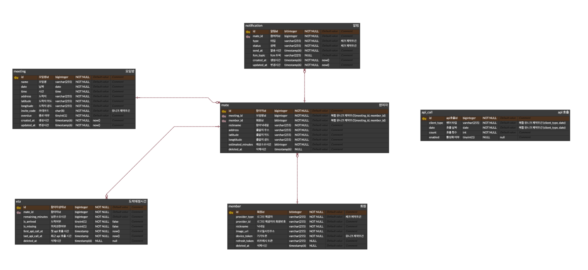
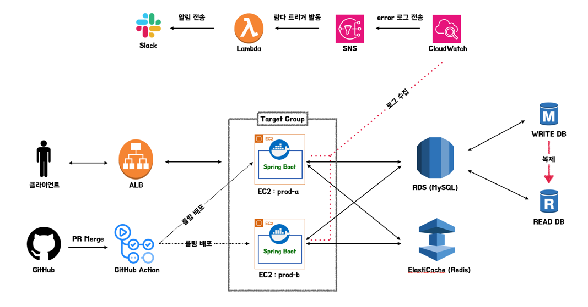

# 오디 백엔드 팀 소개

 

## **Contributors** 🙋🏻‍

|                                                     카키(서현준)                                                      |                                                     조조(조은별)                                                      |                                                     콜리(김건우)                                                      |                                                     제리(김민정)                                                      |
|:----------------------------------------------------------------------------------------------------------------:|:----------------------------------------------------------------------------------------------------------------:|:----------------------------------------------------------------------------------------------------------------:|:----------------------------------------------------------------------------------------------------------------:|
|  |  |  |  |
|                                    [@hyeon0208](https://github.com/hyeon0208)                                    |                                    [@eun-byeol](https://github.com/eun-byeol)                                    |                                 [@coli-geonwoo](https://github.com/coli-geonwoo)                                 |                                       [@mzeong](https://github.com/mzeong)                                       |

 

## **기술 스택** ⚙️

> **Backend**

- Java 17
- Gradle
- Spring Boot
- JPA
- JWT
- Thymeleaf
- JUnit5
- LogBack
- Swagger

 

> **Infra**

- AWS EC2
- AWS RDS(MySQL)
- ElastiCache(Redis)
- GitHub Action
- Docker

 

## **ERD** 📈

 

## **아키텍처 구조** 🏗️

 

## **코드 컨벤션** 📃
- [코드 컨벤션 보러가기](https://sly-face-106.notion.site/0bd7a08f43fa4cb7821bd3392ec3ce5b?pvs=73)
